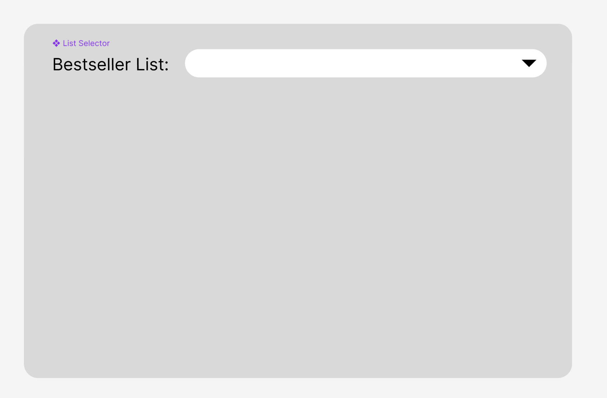

# Fullstack Hands-on exercise
In this assignment we'll be writing a small React application and making some API calls.

## Introduction 
The goal is to build a basic React application that will perform some queries against the New York Times API endpoint and display some results. 
 
The task is structured into several steps that try to resemble how you would normally approach the task of building an app, starting from the most minimal scope, and building your way up to more advanced functionality. 

## Books Bestsellers List APIs
Here is some documentation about the API we’ll be using:
https://developer.nytimes.com/docs/books-product/1/overview


```
Access token
<will be sent over zoom>
```

The Best Sellers API has two endpoints which we will use:

### Bestseller List names (GET)
https://developer.nytimes.com/docs/books-product/1/routes/lists/names.json/get


Returns the List names and the dates that we can query on. 

For example:

1. Children’s Picture Books, newest published date - 2024-02-25
1. Young Adult Paperback, newest published date - 2024-02-18
cURL example:

```bash
curl 'https://api.nytimes.com/svc/books/v3/lists/names.json?api-key=xxx' \
  -H 'Accept: application/json, text/plain, */*'
```


Axios example:
```javascript
const response = await axios.get('https://api.nytimes.com/svc/books/v3/lists/names.json?api-key=xxx')

// Handle the response data here
console.log(response.data);
```

Example response:

```json
{
  "status": "OK",
  "copyright": "Copyright (c) 2024 The New York Times Company.  All Rights Reserved.",
  "num_results": 2,
  "results": [
    {
      "list_name": "Combined Print and E-Book Fiction",
      "display_name": "Combined Print & E-Book Fiction",
      "list_name_encoded": "combined-print-and-e-book-fiction",
      "oldest_published_date": "2011-02-13",
      "newest_published_date": "2024-02-25",
      "updated": "WEEKLY"
    },
    {
      "list_name": "Combined Print and E-Book Nonfiction",
      "display_name": "Combined Print & E-Book Nonfiction",
      "list_name_encoded": "combined-print-and-e-book-nonfiction",
      "oldest_published_date": "2011-02-13",
      "newest_published_date": "2024-02-25",
      "updated": "WEEKLY"
    }
  ]
}
```

### Books in a specific Bestseller List (GET)
https://developer.nytimes.com/docs/books-product/1/routes/lists/%7Bdate%7D/%7Blist%7D.json/get


Returns best selling books, in a specific list, on a specific date.

cURL example
```bash
curl 'https://api.nytimes.com/svc/books/v3/lists/2024-02-25/combined-print-and-e-book-nonfiction.json?offset=0&api-key=xxx' 
```

Axios example
```javascript
const response = await axios.get('https://api.nytimes.com/svc/books/v3/lists/2024-02-25/combined-print-and-e-book-nonfiction.json?api-key=xxx&offset=0');

// Handle the response data here
console.log(response.data);
```

Example response
```json
{
  "status": "OK",
  "num_results": 15,
  "results": {
    "books": [
      {
        "title": "KILLERS OF THE FLOWER MOON",
        "author": "David Grann",
        "amazon_product_url": "https://www.amazon.com/Killers-Flower-Moon-Osage-Murders/dp/0385534248?tag=NYTBSREV-20",

        "buy_links": [
          {
            "name": "Amazon",
            "url": "https://www.amazon.com/Killers-Flower-Moon-Osage-Murders/dp/0385534248?tag=NYTBSREV-20"
          },
          {
            "name": "Apple Books",
            "url": "https://goto.applebooks.apple/9780307742483?at=10lIEQ"
          },
          {
            "name": "Barnes and Noble",
            "url": "https://www.anrdoezrs.net/click-7990613-11819508?url=https%3A%2F%2Fwww.barnesandnoble.com%2Fw%2F%3Fean%3D9780307742483"
          }
        ],
        "book_uri": "nyt://book/c5c1cd05-cdbc-5e7a-8255-1923ab4b1ceb"
      }
    ]
  }
}
```

### Paging 

Paging is controlled by the offset query parameter. Each page will return 20 results, the offset parameter defaults to 0, and should be updated in increments of 20. 


<https://api.nytimes.com/svc/books/v3/lists/2024-02-25/combined-print-and-e-book-nonfiction.json?offset=0&api-key=xxx>


## Coding Task 
Create a React application that has a single page similar to the mock ups presented below. 
 
A few key points to guide you: 
- UI does not have to look pretty - we will not be focusing on the visuals 
- Your focus should be on fast execution and functionality 
- You can use any 3rd-party library in addition to React 
- This is not a memorization task - feel free to use any online documentation, Google, StackOverflow, etc. 
- Please do not try to implement more than one section at a time 
- You can use your own IDE or an online IDE like https://codesandbox.io/ 

### Section 1 - Fetch list names and display drop down
Lets allow the user to browse the various bestseller lists, we’ll do this by showing a drop down and the user can select which list they want to see.

1. Fetch the names of all the bestseller lists
1. Display the names in a dropdown to allow the user to select one



Section 2 - Fetch books from list and display them
Once the user has selected a list, let's fetch all the books from that list and display them.
Instructions 
When the user selects a list, fetch the books in the list, for the latest date available
Display the data in an HTML <table/> with 4 columns 
Title 
Author
Amazon Link (if available)
Apple Books Link (if available)


Let's make the two links clickable


 

Section 3 - Append next page results to the table
Instructions 
Add a "Next" button. When clicked, we should fetch the next page from the API and append / add the new items from the response to the displayed items
There is no need to show the table with paging controls, we’ll just get the next page and append its items to what we’ve already fetched 


Section 4 - Filter items
Add a text box in the top-right corner of the table, this will be the filter input 
When text is inputted, filter the book if they have matching text in their Title column 
Add a label to indicate how many items are filtered, i.e. "Showing X out of Y books" 


Section 5 - Highlighting filter text (optional)
Instructions 
The filter input text should be highlighted in the Title column in the filtered results 


Section 6 - Fetching many items (discussion) 
Instead of fetching just 20 books per request, let's keep querying the API until we get 1000 books, and then show them all to the user. 
 
Question - What kind of UI improvements could we implement to mitigate time-consuming requests and the inherent performance problems that occur when displaying a large amount of data? 

Node / Backend questions pool
We’ll pick a few topics here and discuss briefly


Testing - How would you approach testing a Node.js application? 
What testing frameworks or libraries would you use, and what types of tests would you write?
Are you familiar with unit tests?
Test Driven Design (TDD) - can you think of any advantages this approach has?
Authentication & Authorization - How would you handle authentication and authorization in a Node.js application? What libraries or techniques would you use?
Databases - Describe the role of databases in web applications. 
What are some common types of databases used in the backend
What factors might influence the choice of database for a particular project?
Middleware - explain the concept of middleware in the context of Express.js. How does it work and what are some use cases for middleware?
Async operations - what are asynchronous operations good for in Node.js? Can you think of an example of where this would come in handy?
RESTful API - What is RESTful API design, and why is it important in building scalable and maintainable web applications? 
Can you provide an example of designing a RESTful API endpoint?
GraphQL - are you familiar with it, can you compare between REST and GraphQL?
Scalability - Explain the concept of scalability in the context of backend development. What are some strategies or technologies that can be used to handle increasing load and ensure high availability of a web application
Websockets
What are WebSockets, and how do they differ from traditional HTTP communication? Can you provide an example of a use case where WebSockets would be beneficial in a Node.js application?
Queued workers - are you familiar with this concept? Where would queued workers be helpful?


